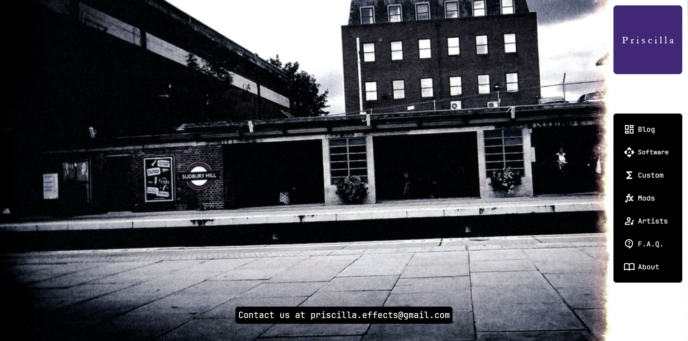
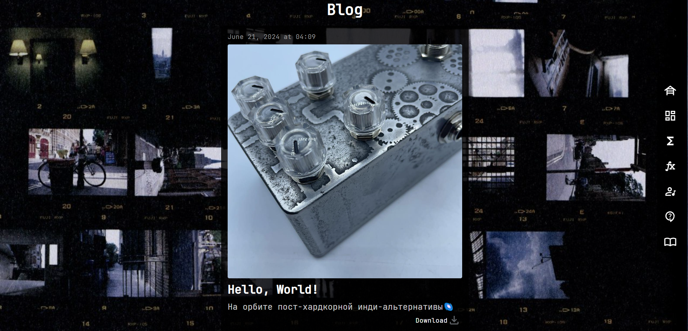
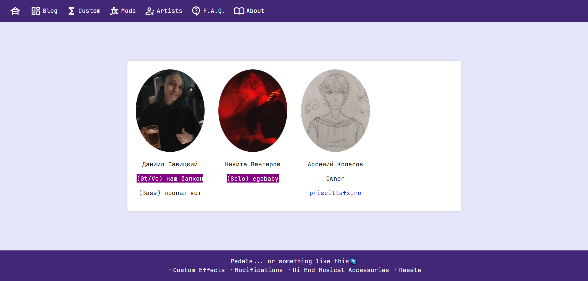
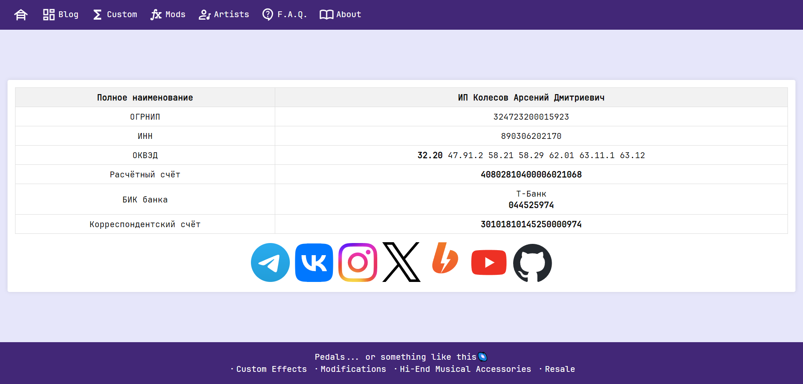

# Priscilla Fx

This project is created as an online store and information resource for the Priscilla Fx workshop.

<p align="center">
    
</p>

## Deploy

```sh
$ git clone https://github.com/priscilla-it/priscillafx_web
$ cd priscillafx_web
$ docker compose up --build
$ sudo chmod +x start
$ ./start
```

## Database Migration Cheat Sheet

`uv run COMMAND`

| Command                                      | Description                                                                          |
| -------------------------------------------- | ------------------------------------------------------------------------------------ |
| alembic revision --autogenerate -m 'initial' | Creates a new migration by automatically detecting changes in the models.            |
| alembic upgrade head                         | Applies all unapplied migrations up to the latest version.                           |
| alembic downgrade -1                         | Rolls back the last applied migration.                                               |
| alembic stamp head                           | Marks the database as updated to the latest version without applying actual changes. |
| alembic history                              | Shows the history of applied migrations.                                             |
| alembic current                              | Displays the current version of the database.                                        |

## Struct

<p align="center">
    
</p>

## Preview

<p align="center">
    
    
    
</p>

## License

Priscilla Fx is licensed under the GPL-3.0 License. You can view the full license text in the [LICENSE](LICENSE) file in the repository.
