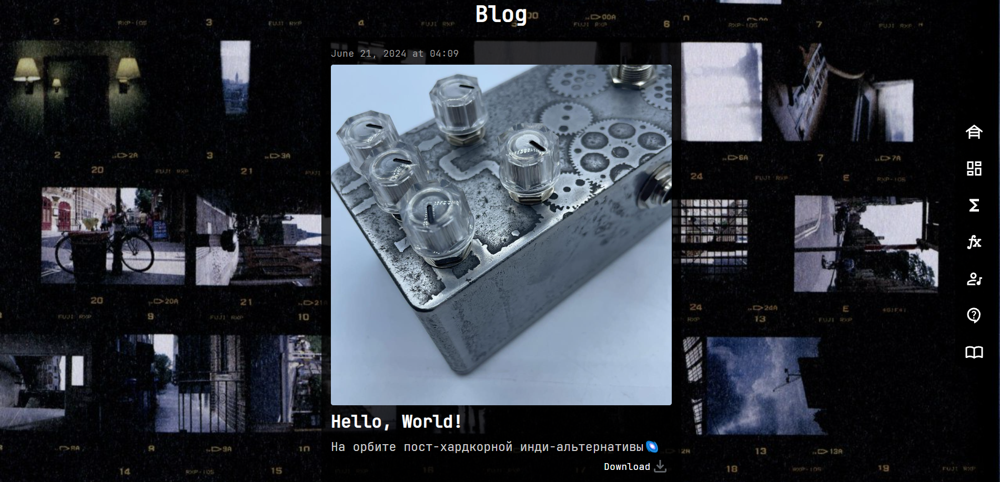
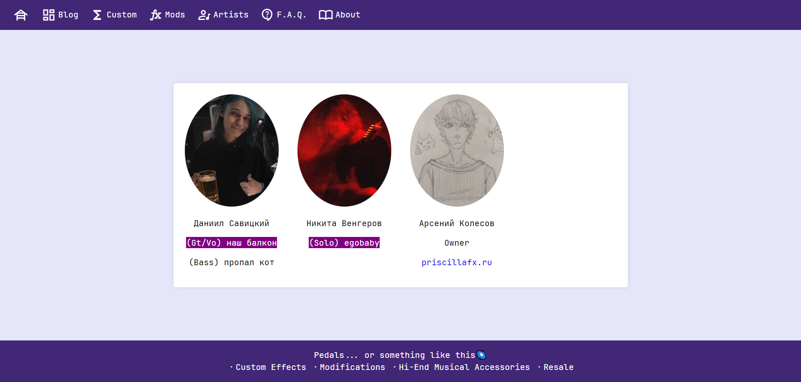
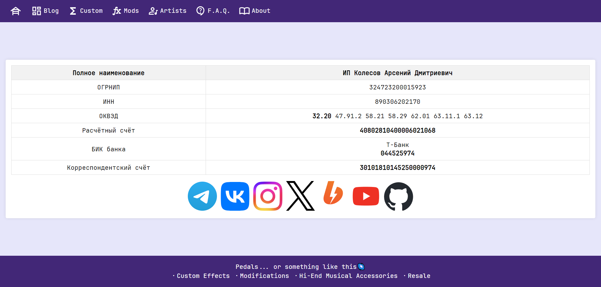

# Priscilla Fx

This project is created as an online store and information resource for the Priscilla Fx workshop.

<p align="center">
    
</p>

## Struct

<p align="center">
    
</p>


## Deploy

```sh
$ git clone https://github.com/priscilla-it/priscillafx_web
$ cd priscillafx_web
$ docker compose up --build
$ sudo chmod +x start
$ ./start
```

## Preview
<p align="center">
    
    
    
</p>


## License

Priscilla Fx is licensed under the GPL-3.0 License. You can view the full license text in the [LICENSE](LICENSE) file in the repository.

